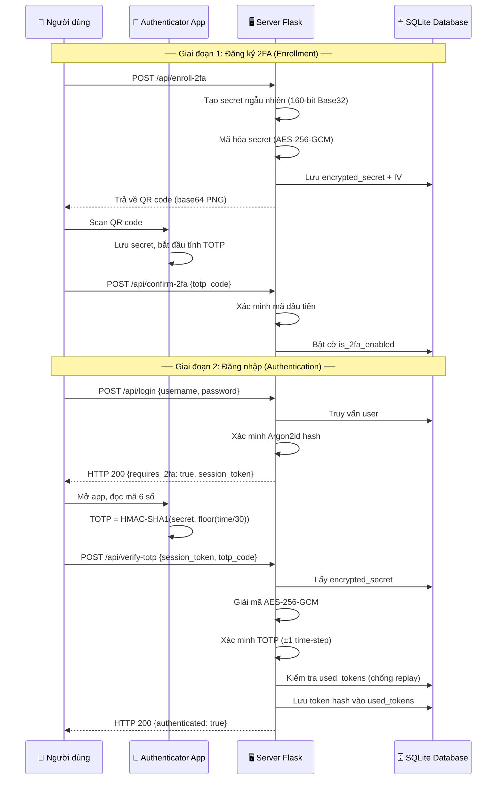

# 🛡️ Hệ Thống Xác Thực Hai Yếu Tố TOTP
### Đồ Án Môn Nhập Môn Bảo Mật Thông Tin — Chủ Đề 9

<div align="center">


**Đại học Tôn Đức Thắng (TDTU) · Khoa Công nghệ Thông tin**  
Nhóm N01_G01 · 52300223 · 52300264 · 52300266

</div>

---

## 📋 Mục Lục

1. [Tổng Quan Dự Án](#1-tổng-quan-dự-án)
2. [Nền Tảng Lý Thuyết](#2-nền-tảng-lý-thuyết)
3. [Kiến Trúc Bảo Mật](#3-kiến-trúc-bảo-mật)
4. [Cấu Trúc Dự Án](#4-cấu-trúc-dự-án)
5. [Cài Đặt & Khởi Chạy](#5-cài-đặt--khởi-chạy)
6. [Hướng Dẫn Sử Dụng](#6-hướng-dẫn-sử-dụng)
7. [Bảo Mật Cơ Sở Dữ Liệu](#7-bảo-mật-cơ-sở-dữ-liệu)
8. [Mô Phỏng Tấn Công](#8-mô-phỏng-tấn-công)
9. [Kết Quả Kiểm Thử](#9-kết-quả-kiểm-thử)
10. [API Reference](#10-api-reference)
11. [Tài Liệu Tham Khảo](#11-tài-liệu-tham-khảo)

---

## 1. Tổng Quan Dự Án

Dự án này triển khai một hệ thống **Xác Thực Đa Yếu Tố (Multi-Factor Authentication — MFA)** hoàn chỉnh theo tiêu chuẩn **RFC 6238 (TOTP)**, được xây dựng theo nguyên tắc **Security by Design** và được kiểm chứng qua ba kịch bản tấn công thực tế.

### Mục Tiêu

| Mục tiêu | Mô tả |
|----------|-------|
| **Triển khai** | Hệ thống 2FA chuẩn RFC 6238 với backend Flask |
| **Bảo mật** | Mã hóa AES-256-GCM, băm Argon2id, chống replay |
| **Kiểm chứng** | Mô phỏng 3 tình huống tấn công và phân tích kết quả |
| **Giao diện** | UI hiện đại glassmorphism với UX tối ưu |

### Thành Phần Chính

```
┌─────────────────────────────────────────────────────┐
│                   TOTP MFA System                   │
├──────────────┬──────────────────┬───────────────────┤
│   Frontend   │     Backend      │    Attack Suite   │
│  HTML/CSS/JS │  Flask + Python  │  3 Attack Scripts │
│  6-digit OTP │  RFC 6238 TOTP   │  Bruteforce       │
│  Timer Ring  │  AES-256-GCM     │  Replay Attack    │
│  QR Wizard   │  Argon2id        │  Clock Skew       │
└──────────────┴──────────────────┴───────────────────┘
```

---

## 2. Nền Tảng Lý Thuyết

### 2.1 Mô Hình Xác Thực Đa Yếu Tố

Hệ thống MFA dựa trên nguyên tắc kết hợp ít nhất hai trong ba yếu tố xác thực độc lập:

```
┌───────────────────────────────────────────────────────────┐
│              Ba Yếu Tố Xác Thực (Authentication Factors)  │
├───────────────────┬───────────────────┬───────────────────┤
│  🧠 Bạn BIẾT gì   │ 📱 Bạn CÓ gì     │  👁 Bạn LÀ ai     │
│  Something You    │  Something You    │  Something You    │
│       Know        │       Have        │       Are         │
├───────────────────┼───────────────────┼───────────────────┤
│ • Mật khẩu        │ • Điện thoại      │ • Vân tay         │
│ • PIN             │ • Token cứng      │ • Nhận diện khuôn │
│ • Câu hỏi bí mật  │ • App TOTP        │   mặt             │
└───────────────────┴───────────────────┴───────────────────┘
```

Dự án này triển khai **Factor 1 (Mật khẩu) + Factor 2 (TOTP từ điện thoại)**.

> **Tại sao 2FA quan trọng?**  
> Nếu mật khẩu bị lộ qua phishing hoặc data breach, kẻ tấn công vẫn cần thiết bị vật lý của người dùng để vượt qua lớp xác thực thứ hai.

---

### 2.2 HOTP vs TOTP — Sự Khác Biệt Cốt Lõi

#### HOTP — RFC 4226 (HMAC-based One-Time Password)

HOTP sử dụng **bộ đếm (counter)** làm tham số biến, tăng dần mỗi lần sử dụng:

```
HOTP(K, C) = Truncate(HMAC-SHA1(K, C))

Trong đó:
  K = Secret key (bí mật chia sẻ)
  C = Counter (bộ đếm tăng dần: 0, 1, 2, 3, ...)
```

**Giải thuật chi tiết (theo RFC 4226):**

```python
# Xem file: mfa-demo/hotp_manual.py
import hmac, hashlib, struct, base64

secret = base64.b32decode("JBSWY3DPEHPK3PXP")
counter = 1

# Bước 1: HMAC-SHA1(K, C)
counter_bytes = struct.pack(">Q", counter)          # 8 bytes big-endian
hmac_hash = hmac.new(secret, counter_bytes, hashlib.sha1).digest()

# Bước 2: Dynamic Truncation
offset = hmac_hash[-1] & 0x0F
binary_code = struct.unpack(">I", hmac_hash[offset:offset+4])[0] & 0x7FFFFFFF

# Bước 3: Lấy 6 chữ số cuối
otp = binary_code % (10 ** 6)
print(f"HOTP: {otp:06d}")
```

**Nhược điểm của HOTP:**
- Bộ đếm phải đồng bộ giữa client và server → dễ mất đồng bộ
- Mã OTP vẫn hợp lệ cho đến khi được sử dụng → cửa sổ tấn công vô hạn

---

#### TOTP — RFC 6238 (Time-based One-Time Password)

TOTP là phần mở rộng của HOTP, thay thế counter bằng **thời gian Unix**:

```
TOTP(K, T) = HOTP(K, T)

Trong đó:
  T = floor(Current_Unix_Time / Time_Step)
  Time_Step = 30 giây (mặc định theo RFC 6238)
```

**Giải thuật TOTP (theo RFC 6238):**

```python
# Xem file: mfa-demo/totp_manual.py
import time, hmac, hashlib, struct, base64

secret = base64.b32decode("JBSWY3DPEHPK3PXP")
period = 30

# Bước 1: Tính time counter
current_time = int(time.time())          # Unix timestamp
counter = current_time // period         # T = floor(time / 30)
print(f"Unix time: {current_time}")
print(f"Time counter: {counter}")

# Bước 2-5: Giống HOTP với counter = T
counter_bytes = struct.pack(">Q", counter)
hmac_hash = hmac.new(secret, counter_bytes, hashlib.sha1).digest()
offset = hmac_hash[-1] & 0x0F
binary_code = struct.unpack(">I", hmac_hash[offset:offset+4])[0] & 0x7FFFFFFF
otp = binary_code % (10 ** 6)
print(f"TOTP: {otp:06d}")
```

#### Bảng So Sánh HOTP vs TOTP

| Tiêu chí | HOTP (RFC 4226) | TOTP (RFC 6238) |
|----------|-----------------|-----------------|
| **Tham số biến** | Counter (đếm tăng) | Thời gian Unix |
| **Thời hạn OTP** | Vô hạn (cho đến khi dùng) | 30 giây |
| **Đồng bộ** | Counter phải khớp | Clock phải đồng bộ (NTP) |
| **Bảo mật** | Thấp hơn (OTP còn hiệu lực lâu) | Cao hơn (tự hết hạn) |
| **Tiêu chuẩn** | RFC 4226 (2005) | RFC 6238 (2011) |
| **Ứng dụng** | Ít phổ biến | Google Auth, Authy, Microsoft Auth |
| **Khuyến nghị** | ⚠️ Legacy | ✅ Industry Standard |

> **Lý do chọn TOTP:**  
> TOTP hết hạn tự động sau 30 giây, giảm đáng kể cửa sổ tấn công so với HOTP. Đây là lý do Google Authenticator, Authy và hầu hết hệ thống MFA hiện đại đều dùng TOTP.

---

### 2.3 Luồng Hoạt Động TOTP



---

## 3. Kiến Trúc Bảo Mật

### 3.1 Security by Design — Triết Lý Thiết Kế

Dự án áp dụng ba nguyên tắc cốt lõi của **Security by Design**:

| Nguyên tắc | Áp dụng trong dự án |
|-----------|---------------------|
| **Defense in Depth** (Phòng thủ chiều sâu) | 5 lớp bảo mật độc lập: Argon2id + AES-GCM + Replay Guard + Rate Limit + Lockout |
| **Least Privilege** (Đặc quyền tối thiểu) | Secret TOTP chỉ được giải mã tại thời điểm xác minh, không cache |
| **Fail-Secure** (Mặc định an toàn) | Mọi lỗi đều dẫn đến từ chối, không bao giờ cấp quyền khi có lỗi |

---

### 3.2 Băm Mật Khẩu — Argon2id

Dự án sử dụng **Argon2id**, thuật toán được OWASP khuyến nghị năm 2023 và là người chiến thắng trong cuộc thi Password Hashing Competition (PHC).

**Tại sao Argon2id tốt hơn bcrypt/SHA-256?**

| Thuật toán | Memory-Hard | GPU Resistant | Side-Channel Safe | OWASP 2023 |
|-----------|-------------|---------------|-------------------|------------|
| SHA-256 | ❌ | ❌ | ❌ | ❌ Không dùng |
| MD5 | ❌ | ❌ | ❌ | ❌ Không dùng |
| bcrypt | Một phần | Một phần | ✅ | ⚠️ Cũ |
| **Argon2id** | ✅ | ✅ | ✅ | ✅ Khuyến nghị |

**Cấu hình trong dự án** (`app/core/auth.py`):

```python
from argon2 import PasswordHasher

_ph = PasswordHasher(
    time_cost=2,        # Số vòng lặp (iterations)
    memory_cost=19_456, # 19 MB RAM — chống GPU attack
    parallelism=1,      # Số luồng song song
    hash_len=32,        # Độ dài hash output
    salt_len=16,        # 128-bit salt ngẫu nhiên
)
```

**Ví dụ hash Argon2id:**
```
$argon2id$v=19$m=19456,t=2,p=1$<16-byte salt>$<32-byte hash>
```

---

### 3.3 Mã Hóa Secret TOTP — AES-256-GCM

Secret TOTP **không bao giờ** được lưu dưới dạng plaintext. Quy trình mã hóa:

```
TOTP_MASTER_KEY (env var)
        │
        ▼
  PBKDF2-SHA256 (600,000 vòng lặp)
        │
        ▼
   AES Key (256-bit) ───┐
                        │
   IV = os.urandom(12) ─┤── AES-256-GCM ──► (ciphertext + GCM tag)
                        │
   Secret (Base32) ─────┘
```

**Tại sao AES-GCM?**

| Chế độ | Mã hóa | Toàn vẹn | Xác thực | Dùng cho |
|--------|--------|----------|----------|---------|
| AES-CBC | ✅ | ❌ | ❌ | Legacy |
| AES-CTR | ✅ | ❌ | ❌ | Streaming |
| **AES-GCM** | ✅ | ✅ | ✅ | **Dự án này** |

AES-GCM cung cấp **Authenticated Encryption** — nếu ai đó thay đổi ciphertext trong database, việc giải mã sẽ thất bại với lỗi `InvalidTag` ngay lập tức.

**Triển khai** (`app/core/crypto.py`):

```python
from cryptography.hazmat.primitives.ciphers.aead import AESGCM
from cryptography.hazmat.primitives.kdf.pbkdf2 import PBKDF2HMAC

def encrypt(plaintext: str, key: bytes) -> tuple[bytes, bytes]:
    iv = os.urandom(12)          # 96-bit IV — KHÔNG BAO GIỜ tái sử dụng
    aesgcm = AESGCM(key)
    ciphertext = aesgcm.encrypt(iv, plaintext.encode(), associated_data=None)
    return ciphertext, iv        # ciphertext bao gồm GCM authentication tag

def decrypt(ciphertext: bytes, iv: bytes, key: bytes) -> str:
    try:
        aesgcm = AESGCM(key)
        return aesgcm.decrypt(iv, ciphertext, None).decode()
    except InvalidTag:
        raise ValueError("Dữ liệu bị can thiệp — từ chối giải mã!")
```

> **Cảnh báo bảo mật:**  
> `TOTP_MASTER_KEY` trong file `.env` phải có độ entropy tối thiểu 256 bit. Không bao giờ commit file `.env` lên Git. Sử dụng lệnh `python -c "import secrets; print(secrets.token_hex(32))"` để tạo key.

---

### 3.4 Replay Guard — Chống Tấn Công Phát Lại

Một OTP hợp lệ có thể bị đánh cắp (qua MITM hoặc shoulder-surfing) và phát lại trong cùng cửa sổ 30 giây. **Replay Guard** ngăn chặn điều này:

```
Khi xác minh TOTP thành công:
    token_hash = SHA-256(otp_code)

    Bước 1: Truy vấn used_tokens
            WHERE user_id = ? AND token_hash = ? AND time_step = ?
            → Nếu tìm thấy: TỪ CHỐI (401 "Code đã được sử dụng")

    Bước 2: Nếu không tìm thấy → GHI NHẬN
            INSERT INTO used_tokens (user_id, token_hash, time_step)
            → UNIQUE INDEX đảm bảo tính nguyên tử (race-condition safe)
```

**Tại sao hash token thay vì lưu plaintext?**

Dù OTP chỉ có hiệu lực 30 giây, lưu plaintext OTP trong database tạo ra bề mặt tấn công không cần thiết. SHA-256 của 6 chữ số cho phép lookup O(1) mà không tiết lộ thông tin.

---

### 3.5 Giới Hạn Tốc Độ & Khóa Tài Khoản

**Tại sao rate limiting là phòng thủ QUAN TRỌNG nhất?**

```
Không có rate limiting:
  Không gian khóa OTP = 1,000,000 (6 chữ số)
  Thời gian cửa sổ   = 30 giây
  Tốc độ tấn công    = 1,000 req/s
  
  P(đoán đúng) = 1,000 × 30 / 1,000,000 = 3.0% mỗi cửa sổ
  → Kẻ tấn công có thể bẻ khóa trong ~17 phút!

Có rate limiting (5 lần/30 giây):
  P(đoán đúng) = 5 / 1,000,000 = 0.0005% mỗi cửa sổ
  Thời gian ước tính = ~69 ngày!

Có khóa tài khoản tiến triển:
  → Thực tế KHÔNG KHẢ THI
```

**Chính sách khóa tài khoản 3 bậc:**

| Bậc | Điều kiện | Thời gian khóa | Mức độ |
|-----|----------|----------------|--------|
| Tier 1 | ≥ 5 lần thất bại liên tiếp | 15 phút | ⚠️ Cảnh báo |
| Tier 2 | ≥ 10 lần thất bại liên tiếp | 1 giờ | 🔒 Nghiêm trọng |
| Tier 3 | ≥ 20 lần thất bại liên tiếp | 24 giờ | 🚨 Cần xem xét thủ công |

**Giới hạn theo IP (flask-limiter):**

```
Xác minh TOTP: Tối đa 20 request/phút theo IP
Đăng ký:       Tối đa 5 request/phút theo IP
Đăng nhập:     Tối đa 10 request/phút theo IP
```

---

### 3.6 Dung Sai Lệch Đồng Hồ (Clock Skew Tolerance)

Trong thực tế, đồng hồ của điện thoại người dùng có thể lệch với đồng hồ server (do NTP delay, drift phần cứng, v.v.). Hệ thống chấp nhận `valid_window=1` — tức là OTP từ bước thời gian liền kề cũng hợp lệ:

```
Hiện tại: step = T
Chấp nhận: step ∈ {T-1, T, T+1}
→ Dung sai: ±30 giây

Phân tích đánh đổi bảo mật:
┌──────────────┬────────────┬─────────────────┬──────────────────┐
│ valid_window │ Dung sai   │ Mã hợp lệ đồng  │ P(đoán brute)    │
│              │            │ thời            │                  │
├──────────────┼────────────┼─────────────────┼──────────────────┤
│ 0            │ 0 giây     │ 1 mã            │ 0.0001%          │
│ 1 (mặc định) │ ±30 giây   │ 3 mã            │ 0.0003% ← CHỌN  │
│ 2            │ ±60 giây   │ 5 mã            │ 0.0005%          │
│ 3            │ ±90 giây   │ 7 mã            │ 0.0007%          │
└──────────────┴────────────┴─────────────────┴──────────────────┘
```

RFC 6238 §5.2 khuyến nghị `valid_window=1` là giá trị mặc định tối ưu.

---

## 4. Cấu Trúc Dự Án

```
mfa-demo/
│
├── 📁 app/                          # Flask application package
│   ├── __init__.py                  # App factory (create_app)
│   ├── config.py                    # Cấu hình từ biến môi trường
│   │
│   ├── 📁 core/                     # Business logic cốt lõi
│   │   ├── crypto.py                # AES-256-GCM + PBKDF2 key derivation
│   │   ├── auth.py                  # Argon2id password hashing
│   │   └── totp_engine.py           # RFC 6238 TOTP + Replay Guard + QR
│   │
│   ├── 📁 models/
│   │   └── database.py              # SQLite connection + schema init
│   │
│   ├── 📁 middleware/
│   │   └── rate_limiter.py          # Flask-Limiter + account lockout
│   │
│   ├── 📁 routes/
│   │   ├── auth_routes.py           # API: /api/login, /api/verify-totp, ...
│   │   └── page_routes.py           # HTML page routing
│   │
│   ├── 📁 templates/                # Jinja2 HTML templates
│   │   ├── base.html
│   │   ├── login.html               # Dark glassmorphism login
│   │   ├── register.html
│   │   ├── verify_totp.html         # 6-digit input + countdown ring
│   │   ├── enroll_2fa.html          # 3-step enrollment wizard
│   │   └── dashboard.html           # Security dashboard
│   │
│   └── 📁 static/
│       ├── css/styles.css           # Design system (glassmorphism)
│       └── js/
│           ├── login.js             # 2-phase login handler
│           ├── verify.js            # OTP input + timer animation
│           └── enroll.js            # Enrollment wizard logic
│
├── 📁 database/
│   └── schema.sql                   # SQLite schema (4 tables)
│
├── 📁 attacks/                      # Công cụ mô phỏng tấn công
│   ├── helpers.py                   # Shared utilities (auto-setup user, session)
│   ├── attack_bruteforce.py         # Kịch bản 1: Vét cạn
│   ├── attack_replay.py             # Kịch bản 2: Phát lại token
│   └── attack_clock_skew.py         # Kịch bản 3: Phân tích lệch đồng hồ
│
├── 📁 tests/
│   ├── test_totp_engine.py          # 20 unit tests: crypto, TOTP, Argon2id
│   └── test_auth_routes.py          # 11 integration tests: API endpoints
│
│
├── run.py                           # Entry point: python run.py
├── requirements.txt                 # Python dependencies
├── .env.example                     # Template biến môi trường
└── README.md                        # File này
```

---

## 5. Cài Đặt & Khởi Chạy

### 5.1 Yêu Cầu Hệ Thống

| Thành phần | Phiên bản tối thiểu |
|-----------|---------------------|
| Python | 3.11+ |
| pip | 23.0+ |
| Hệ điều hành | Windows 10 / macOS 12 / Ubuntu 22.04 |
| Điện thoại | iOS 15+ hoặc Android 10+ (cho Google Authenticator) |

### 5.2 Cài Đặt Từng Bước

#### Bước 1: Di chuyển vào thư mục dự án

```bash
cd d:\TDTU\Sem2-2526\InfoSec\mfa-demo
```

#### Bước 2: Tạo Virtual Environment (khuyến nghị)

```bash
python -m venv venv

# Windows
venv\Scripts\activate

# macOS / Linux
source venv/bin/activate
```

#### Bước 3: Cài đặt các thư viện

```bash
pip install -r requirements.txt
```

Danh sách thư viện chính:

```
flask>=3.0.0          # Web framework
pyotp>=2.9.0          # RFC 6238 TOTP implementation
qrcode[pil]>=7.4.2    # QR code generation
cryptography>=42.0.0  # AES-256-GCM, PBKDF2
argon2-cffi>=23.1.0   # Argon2id password hashing
flask-limiter>=3.5.0  # IP-based rate limiting
flask-wtf>=1.2.1      # CSRF protection
python-dotenv>=1.0.0  # Environment variable loading
requests>=2.31.0      # Attack scripts HTTP client
pytest>=8.0.0         # Testing framework
```

#### Bước 4: Cấu hình biến môi trường

```bash
# Sao chép template
copy .env.example .env   # Windows
cp .env.example .env     # macOS/Linux
```

Chỉnh sửa file `.env`:

```env
# Tạo SECRET_KEY ngẫu nhiên
SECRET_KEY=<chạy: python -c "import secrets; print(secrets.token_hex(32))">

# Tạo TOTP_MASTER_KEY ngẫu nhiên (KHÁC với SECRET_KEY)
TOTP_MASTER_KEY=<chạy: python -c "import secrets; print(secrets.token_hex(32))">

FLASK_ENV=development
DATABASE_PATH=database/mfa_demo.db
TOTP_ISSUER=TDTU-InfoSec-MFA
```

> **Cảnh báo:**  
> Không dùng các giá trị mặc định từ `.env.example` trong môi trường thực tế. Luôn thêm `.env` vào `.gitignore`.

#### Bước 5: Khởi động server

```bash
python run.py
```

Output mong đợi:
```
 * Serving Flask app 'app'
 * Debug mode: on
 * Running on http://0.0.0.0:5000
```

#### Bước 6: Truy cập ứng dụng

Mở trình duyệt và truy cập: **`http://localhost:5000`**

---

## 6. Hướng Dẫn Sử Dụng

### 6.1 Quy Trình Đăng Ký & Kích Hoạt 2FA

```
[1] Đăng ký tài khoản     [2] Tải app thật            [3] Quét QR code
 /register                  Google Authenticator         /enroll-2fa
 ┌──────────────┐           ┌───────────────┐           ┌─────────────┐
 │ Username     │           │ App Store /   │           │ ████████████│
 │ Email        │    →      │ Google Play   │    →      │ ██  ██  ████│
 │ Password     │           │               │           │ ████████████│
 │ [Đăng ký]    │           │ Cài và mở app │           │ [Xác nhận]  │
 └──────────────┘           └───────────────┘           └─────────────┘

[4] Nhập mã xác minh       [5] 2FA kích hoạt          [6] Đăng nhập 2 bước
 /enroll-2fa (step 3)       /dashboard                  /login → /verify-mfa
 ┌──────────────┐           ┌───────────────┐           ┌─────────────┐
 │ [1][2][3]    │           │ ✅ 2FA Active│            │ 🔢 ••••••  │
 │ [4][5][6]    │    →      │ Bảo mật cao   │    →      │ ⏱ 25s      │
 │ [Xác nhận]   │           │               │           │ [Xác minh]  │
 └──────────────┘           └───────────────┘           └─────────────┘
```

### 6.2 Ứng Dụng Authenticator Được Hỗ Trợ

| Ứng dụng | Nền tảng | Link tải |
|----------|---------|---------|
| Google Authenticator | iOS / Android | App Store / Google Play |
| Authy | iOS / Android / Desktop | authy.com |
| Microsoft Authenticator | iOS / Android | App Store / Google Play |
| 1Password | iOS / Android / Desktop | 1password.com |

### 6.3 Luồng Đăng Nhập 2 Bước

```
Bước 1: Nhập mật khẩu           Bước 2: Nhập mã TOTP
┌────────────────────┐           ┌───────────────────────────┐
│ 🛡️ TDTU MFA Demo  │           │ 📱 Two-Factor Auth        │
│                    │           │                           │
│ Welcome back       │           │ Verify Your Identity      │
│                    │  Phase 1  │                           │
│ Username: [     ]  │ ────────► │      ⏱ 25 giây           │
│ Password: [     ]  │ password  │   [1][2][3][4][5][6]      │
│                    │  check    │                           │
│ [Sign In]          │           │ [  Verify Code  ]         │
└────────────────────┘           └───────────────────────────┘
                                   ↓ Thành công
                              /dashboard
```

---

## 7. Bảo Mật Cơ Sở Dữ Liệu

### 7.1 Schema Database

```sql
-- Bảng 1: Thông tin xác thực người dùng
CREATE TABLE users (
    id              INTEGER PRIMARY KEY AUTOINCREMENT,
    username        TEXT UNIQUE NOT NULL,
    email           TEXT UNIQUE NOT NULL,
    password_hash   TEXT NOT NULL,           -- Argon2id hash
    is_2fa_enabled  BOOLEAN DEFAULT 0,
    locked_until    TIMESTAMP NULL,          -- Thời điểm hết khóa
    failed_attempts INTEGER DEFAULT 0        -- Số lần thất bại liên tiếp
);

-- Bảng 2: Secret TOTP (luôn mã hóa)
CREATE TABLE totp_secrets (
    user_id          INTEGER UNIQUE NOT NULL,
    encrypted_secret BLOB NOT NULL,          -- AES-256-GCM ciphertext
    encryption_iv    BLOB NOT NULL           -- 96-bit IV
);

-- Bảng 3: Token đã sử dụng (chống replay)
CREATE TABLE used_tokens (
    user_id    INTEGER NOT NULL,
    token_hash TEXT NOT NULL,                -- SHA-256(otp_code)
    time_step  INTEGER NOT NULL              -- floor(unix_time / 30)
);
CREATE UNIQUE INDEX idx_used_tokens ON used_tokens(user_id, token_hash, time_step);

-- Bảng 4: Nhật ký đăng nhập (audit trail)
CREATE TABLE login_attempts (
    user_id      INTEGER,
    ip_address   TEXT NOT NULL,
    attempt_type TEXT NOT NULL,              -- 'password' | 'totp' | 'enroll'
    success      BOOLEAN NOT NULL,
    attempted_at TIMESTAMP DEFAULT CURRENT_TIMESTAMP
);
```

### 7.2 Nguyên Tắc Tách Biệt Bí Mật

```
 Database bị xâm phạm — Kẻ tấn công thấy:
 ┌────────────────────────────────────────────────┐
 │ users.password_hash:                           │
 │ $argon2id$v=19$m=19456,t=2,p=1$<salt>$<hash>  │
 │ → Cần crack Argon2id (nhiều GB RAM, nhiều ngày)│
 │                                                │
 │ totp_secrets.encrypted_secret:                 │
 │ b'\x8f\x3a\xc7...' (AES-256-GCM ciphertext)   │
 │ → Cần TOTP_MASTER_KEY từ server env var        │
 │                                                │
 │ used_tokens.token_hash:                        │
 │ "e3b0c44298fc1c149afb..." (SHA-256)            │
 │ → Không thể reverse về OTP gốc (already used) │
 └────────────────────────────────────────────────┘
 → Database dump KHÔNG đủ để giả mạo đăng nhập!
```

---

## 8. Mô Phỏng Tấn Công

> **⚠️ Cảnh báo:**  
> Các script tấn công này được tạo ra cho mục đích **giáo dục và nghiên cứu** tại môi trường lab được kiểm soát. Chỉ sử dụng trên hệ thống của chính bạn. Việc kiểm thử trái phép là vi phạm pháp luật.

### Cấu Trúc Attack Suite

Tất cả script chia sẻ `helpers.py` cung cấp:
- `setup_2fa_user()`: tự động đăng ký user, kích hoạt 2FA, trả về `session_token` + `secret`
- `get_fresh_session()`: lấy session token mới khi cần
- `print_header()`, `time_step_info()`: tiện ích hiển thị

> **Không cần thao tác thủ công** — các script tự tạo user test và dọn dẹp. Chỉ cần server đang chạy.

---

### 8.1 Kịch Bản 1: Tấn Công Vét Cạn (Brute-Force)

**Mục tiêu:** Chứng minh rằng không gian khóa 1.000.000 mã OTP không thể vét cạn nếu có rate limiting.

**Phân tích toán học:**

```
Không có bảo vệ:
  P(đoán đúng trong 30s) = R × 30 / 1,000,000
  Với R = 1,000 req/s → P = 3.0% → Vét cạn trong ~17 phút

Có rate limiting (5 lần/30s):
  P(đoán đúng) = 5 / 1,000,000 = 5 × 10⁻⁶
  Cần 200,000 cửa sổ × 30s = 69 ngày

Có khóa tài khoản tiến triển:
  Sau 20 lần → khóa 24h → KHÔNG KHẢ THI THỰC TẾ
```

**Chạy script:**

```bash
# Chế độ tuần tự (mặc định)
python attacks/attack_bruteforce.py --target http://localhost:5000

# Chế độ ngẫu nhiên
python attacks/attack_bruteforce.py --target http://localhost:5000 --mode random

# Chế độ song song (nhiều luồng)
python attacks/attack_bruteforce.py --target http://localhost:5000 --mode parallel --threads 5

# Chạy tất cả các chế độ
python attacks/attack_bruteforce.py --target http://localhost:5000 --mode all

# Tùy chỉnh số lần thử tối đa
python attacks/attack_bruteforce.py --max-attempts 100
```

**Kết quả mong đợi:**

```
=================================================================
  Scenario 1: TOTP Brute-Force Attack
=================================================================
  Target: http://localhost:5000

--- Setting up target user: bf_victim_12345 ---
  [+] User 'bf_victim_12345' registered
  [+] TOTP secret generated: JBSWY3DPEHPK...
  [+] 2FA confirmed (code: 482731)
  [+] Pending 2FA session: a1b2c3d4e5f6...

============================================================
  SCENARIO 1A: Sequential Brute-Force
  Trying codes 000000 to 000049
============================================================
  [   5] OTP=000004 -> HTTP 423

  [!] ACCOUNT LOCKED after 5 attempts!
      Retry after: 900s

============================================================
  ATTACK ANALYSIS
============================================================
  Mode:           sequential
  Total attempts: 5
  Elapsed:        0.82s
  Rate:           6.1 req/s

  Outcome:
    [PROTECTED]  Account locked after 5 attempts

  Mathematical Analysis:
    OTP keyspace:           1,000,000 (6 digits)
    Attempts before block:  5
    P(guess in 30s window) = 0.018300%
    P(guess before lockout) = 0.000500%
    Windows needed to scan: 200,000
    Expected time to crack: 69.4 days
```

---

### 8.2 Kịch Bản 2: Tấn Công Phát Lại Token (Token Replay)

**Mục tiêu:** Chứng minh rằng một OTP hợp lệ không thể dùng hai lần, kể cả trong cùng cửa sổ 30 giây.

**Kịch bản tấn công:**
```
T=0s:  Người dùng hợp pháp gửi OTP "482731" → Đăng nhập thành công
T=2s:  Kẻ tấn công (đã đánh cắp OTP) gửi lại "482731" → ?
T=5s:  Kẻ tấn công thử lại trong cùng cửa sổ → ?
T=?:   Kẻ tấn công dùng mã từ cửa sổ tiếp theo → ?
```

**Chạy script:**

```bash
python attacks/attack_replay.py --target http://localhost:5000
```

> Script tự động tạo user, enroll 2FA, và chạy 4 test. Không cần cung cấp `session_token` hay `secret`.

**Kết quả mong đợi:**

```
=================================================================
  Scenario 2: TOTP Replay Attack
=================================================================
  Target: http://localhost:5000

--- Setting up target user: rp_victim_12345 ---
  [+] User 'rp_victim_12345' registered
  [+] TOTP secret generated: JBSWY3DPEHPK...
  [+] 2FA confirmed (code: 482731)
  [+] Pending 2FA session: a1b2c3d4e5f6...
  [*] Waiting 8s for next TOTP window...

============================================================
  SCENARIO 2: Token Replay Attack Tests
============================================================
  Current OTP:  918234
  Time step:    57249877
  Window ends:  28s remaining

  TEST 1: First Use (Legitimate Authentication)
  [First Use] Code: 918234
  [First Use] -> HTTP 200 [OK] Authentication successful.

  TEST 2: Immediate Replay (Same Code, New Session)
  [Immediate Replay] Code: 918234
  [Immediate Replay] -> HTTP 401 [BLOCKED] This code has already been used.

  TEST 3: Delayed Replay (Same Code, 5s Later)
  [Delayed Replay] Waiting 5s...
  [Delayed Replay] Code: 918234
  [Delayed Replay] -> HTTP 401 [BLOCKED] This code has already been used.

  TEST 4: Adjacent Window Code (Different, Unused Code)
  [*] Using code from next time step: 572634
  [Adjacent Window] Code: 572634
  [Adjacent Window] -> HTTP 200 [OK] Authentication successful.

============================================================
  REPLAY ATTACK ANALYSIS
============================================================
  First Use              Code: 918234  HTTP 200 [OK]
  Immediate Replay       Code: 918234  HTTP 401 [BLOCKED]
  Delayed Replay         Code: 918234  HTTP 401 [BLOCKED]
  Adjacent Window        Code: 572634  HTTP 200 [OK]

  Verdict: SECURE - Replay attacks are fully blocked

  HOW REPLAY PREVENTION WORKS:

  1. Pre-verification check
     Server checks used_tokens table BEFORE crypto verification (O(1)).

  2. Token hashing
     Stores SHA-256(code), never plaintext.

  3. Multi-step scanning
     Checks ALL time steps within valid_window (default: +-1).

  4. Database-level enforcement
     UNIQUE INDEX prevents race conditions.
```

---

### 8.3 Kịch Bản 3: Phân Tích Lệch Đồng Hồ (Clock Skew)

**Mục tiêu:** Xác định chính xác cửa sổ dung sai đồng hồ của hệ thống và phân tích đánh đổi bảo mật.

**Chạy script:**

```bash
# Mặc định: -90s đến +90s, bước 30s
python attacks/attack_clock_skew.py --target http://localhost:5000

# Tùy chỉnh phạm vi và bước nhảy
python attacks/attack_clock_skew.py --range 180 --step 15
```

> Script tự động tạo user và enroll 2FA. OTP được tính thủ công theo RFC 6238 để mô phỏng đồng hồ lệch.

**Kết quả mong đợi:**

```
=================================================================
  Scenario 3: TOTP Clock Skew Analysis
=================================================================
  Target: http://localhost:5000

--- Setting up target user: cs_victim_12345 ---
  [+] User 'cs_victim_12345' registered
  [+] TOTP secret generated: JBSWY3DPEHPK...
  [+] 2FA confirmed (code: 482731)
  [+] Pending 2FA session: a1b2c3d4e5f6...

============================================================
  SCENARIO 3: Clock Skew / Drift Analysis
============================================================
  Testing offsets: -90s to +90s (step: 30s)
  Server time step: 57249877
  Window remaining: 25s

    Offset |   Step |      OTP |        Result | HTTP
  ----------+--------+----------+--------------+-----
    -90s |     -3 |   738291 |      REJECTED | 401
    -60s |     -2 |   482011 |      REJECTED | 401
    -30s |     -1 |   319847 |      ACCEPTED | 200
      0s |      0 |   572634 |      ACCEPTED | 200
    +30s |     +1 |   847219 |      ACCEPTED | 200
    +60s |     +2 |   103482 |      REJECTED | 401
    +90s |     +3 |   928374 |      REJECTED | 401

============================================================
  CLOCK SKEW ANALYSIS RESULTS
============================================================
  Accepted offset range: -30s to +30s
    Equivalent time steps: -1 to +1
    Total accepted range: 60s
    Active valid codes: 3

  Total tested:    7
  Accepted:        3
  Rejected:        4
  Account locked:  False

  RECOMMENDATION: valid_window=1 (this system's configuration)
    - Handles normal NTP drift (phones sync within +-5s)
    - Only 3 codes valid simultaneously (negligible security impact)
    - RFC 6238 section 5.2 recommended default
```

---

## 9. Kết Quả Kiểm Thử

### 9.1 Unit & Integration Tests

```bash
# Chạy toàn bộ test suite
python -m pytest tests/ -v

# Kết quả
=================== test session starts ===================
collecting ... collected 31 items

tests/test_totp_engine.py::TestCrypto::test_encrypt_decrypt_roundtrip     PASSED
tests/test_totp_engine.py::TestCrypto::test_different_encryptions_produce_different_iv PASSED
tests/test_totp_engine.py::TestCrypto::test_tampered_ciphertext_raises    PASSED
tests/test_totp_engine.py::TestCrypto::test_wrong_key_raises              PASSED
tests/test_totp_engine.py::TestCrypto::test_hash_token_deterministic      PASSED
tests/test_totp_engine.py::TestCrypto::test_hash_token_different_codes    PASSED
tests/test_totp_engine.py::TestCrypto::test_hash_token_is_hex_string      PASSED
tests/test_totp_engine.py::TestTOTPVerification::test_current_valid_code_accepted    PASSED
tests/test_totp_engine.py::TestTOTPVerification::test_old_code_rejected   PASSED
tests/test_totp_engine.py::TestTOTPVerification::test_adjacent_window_accepted      PASSED
tests/test_totp_engine.py::TestTOTPVerification::test_qr_uri_format       PASSED
tests/test_totp_engine.py::TestTOTPVerification::test_hash_token_uniqueness PASSED
tests/test_totp_engine.py::TestPasswordHashing::test_correct_password_verifies     PASSED
tests/test_totp_engine.py::TestPasswordHashing::test_wrong_password_rejected       PASSED
tests/test_totp_engine.py::TestPasswordHashing::test_hashes_are_unique    PASSED
tests/test_totp_engine.py::TestPasswordHashing::test_hash_format          PASSED
tests/test_totp_engine.py::TestPasswordHashing::test_empty_password_still_works    PASSED
tests/test_auth_routes.py::TestRegister::test_register_success            PASSED
tests/test_auth_routes.py::TestRegister::test_register_duplicate_username PASSED
tests/test_auth_routes.py::TestRegister::test_register_short_username     PASSED
tests/test_auth_routes.py::TestRegister::test_register_short_password     PASSED
tests/test_auth_routes.py::TestRegister::test_register_invalid_email      PASSED
tests/test_auth_routes.py::TestLogin::test_login_no_2fa                   PASSED
tests/test_auth_routes.py::TestLogin::test_login_wrong_password           PASSED
tests/test_auth_routes.py::TestLogin::test_login_nonexistent_user         PASSED
tests/test_auth_routes.py::TestLogin::test_login_missing_fields           PASSED
tests/test_auth_routes.py::TestLogin::test_status_unauthenticated         PASSED
tests/test_auth_routes.py::TestLogin::test_status_authenticated           PASSED
tests/test_auth_routes.py::TestLogin::test_logout                         PASSED
tests/test_auth_routes.py::TestVerifyTotp::test_verify_invalid_session_token    PASSED
tests/test_auth_routes.py::TestVerifyTotp::test_verify_invalid_code_format      PASSED

===================== 31 passed in 5.01s =====================
```

### 9.2 Bảng Kết Quả Tấn Công

| Kịch bản | Trạng thái trước bảo vệ | Trạng thái sau bảo vệ | Cơ chế phòng thủ |
|---------|--------------------|-------------------|-----------------|
| **Brute-Force** | ❌ Vét cạn ~17 phút | ✅ Bị chặn sau 5 lần | Rate limit + Account lockout |
| **Token Replay** | ❌ Dùng lại OTP thành công | ✅ HTTP 401 "Already used" | Replay Guard (SHA-256 + DB) |
| **Clock Skew -60s** | ❌ Có thể lợi dụng | ✅ HTTP 401 rejected | valid_window=1 (±30s only) |
| **Clock Skew +60s** | ❌ Có thể lợi dụng | ✅ HTTP 401 rejected | valid_window=1 (±30s only) |
| **Tampered Secret** | N/A | ✅ InvalidTag exception | AES-GCM authentication |

---

## 10. API Reference

### Xác Thực (Authentication)

| Method | Endpoint | Body | Response | Rate Limit |
|--------|----------|------|----------|-----------|
| `POST` | `/api/register` | `{username, email, password}` | `{success, user_id}` | 5/phút |
| `POST` | `/api/login` | `{username, password}` | `{requires_2fa, session_token}` | 10/phút |
| `POST` | `/api/verify-totp` | `{session_token, totp_code}` | `{authenticated, redirect}` | 20/phút |
| `POST` | `/api/logout` | — | `{success}` | — |
| `GET` | `/api/status` | — | `{authenticated, user}` | 30/phút |

### Đăng Ký 2FA

| Method | Endpoint | Body | Response | Rate Limit |
|--------|----------|------|----------|-----------|
| `POST` | `/api/enroll-2fa` | `{user_id}` | `{qr_image, manual_secret, uri}` | 3/phút |
| `POST` | `/api/confirm-2fa` | `{totp_code}` | `{success, redirect}` | 5/phút |

### HTTP Status Codes

| Code | Ý nghĩa |
|------|---------|
| `200` | Thành công |
| `201` | Tạo mới thành công |
| `400` | Dữ liệu đầu vào không hợp lệ |
| `401` | Xác thực thất bại |
| `409` | Trùng lặp (username/email đã tồn tại) |
| `423` | Tài khoản bị khóa — xem `retry_after_seconds` |
| `429` | Quá nhiều request theo IP |
| `500` | Lỗi server nội bộ |

---

## 11. Tài Liệu Tham Khảo

### Tiêu Chuẩn & RFC

| Tài liệu | Liên kết |
|---------|---------|
| RFC 4226 — HOTP | https://datatracker.ietf.org/doc/html/rfc4226 |
| RFC 6238 — TOTP | https://datatracker.ietf.org/doc/html/rfc6238 |
| NIST SP 800-63B — Digital Identity | https://pages.nist.gov/800-63-3/sp800-63b.html |
| NIST SP 800-38D — GCM | https://csrc.nist.gov/publications/detail/sp/800-38d/final |

### Bảo Mật & Thư Viện

| Tài liệu | Liên kết |
|---------|---------|
| OWASP Authentication Cheat Sheet | https://cheatsheetseries.owasp.org/cheatsheets/Authentication_Cheat_Sheet.html |
| OWASP Password Storage | https://cheatsheetseries.owasp.org/cheatsheets/Password_Storage_Cheat_Sheet.html |
| Argon2 Specification | https://www.password-hashing.net/argon2-specs.pdf |
| pyotp Documentation | https://github.com/pyauth/pyotp |
| cryptography.io | https://cryptography.io/en/latest/ |

### Sách Giáo Khoa

```
[1] Stallings, W. (2017). Cryptography and Network Security: Principles 
    and Practice (7th ed.). Pearson Education.

[2] Anderson, R. (2020). Security Engineering: A Guide to Building 
    Dependable Distributed Systems (3rd ed.). Wiley.

[3] Suleski, T., et al. (2023). A Review of Multi-Factor Authentication 
    in the Internet of Healthcare Things. Digital Communications and 
    Networks.
```

---

<div align="center">

**Được phát triển bởi Nhóm N01_G01**  
Môn An Toàn Thông Tin · Đại học Tôn Đức Thắng · 2026

*"Security is not a product, but a process."* — Bruce Schneier

</div>
