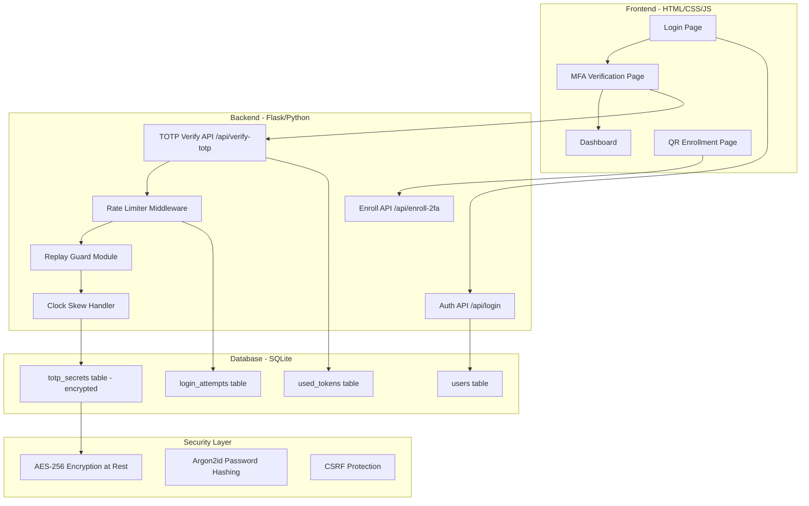
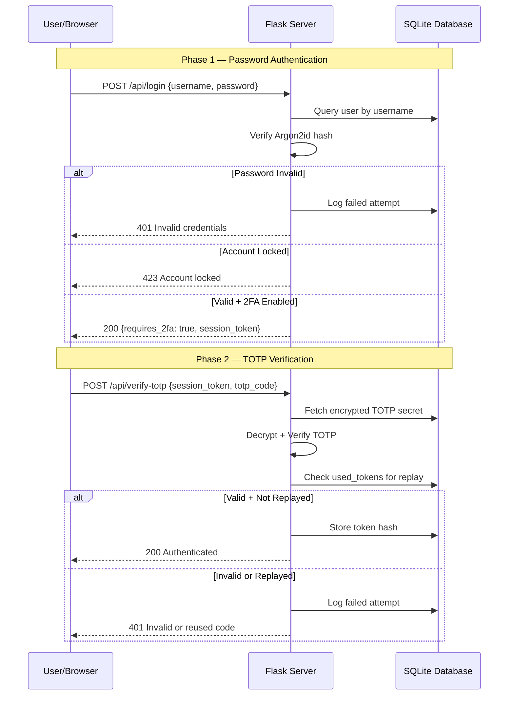

# 🛡️ 48-Hour TOTP 2FA Implementation & Attack Simulation Plan

> **Course:** Information Security (BMTT) — TDTU  
> **Topic:** Topic 9 – Multi-Factor Authentication  
> **Team:** N01_G01 (52300223, 52300264, 52300266)  
> **Start Date:** 2026-04-06  
> **Methodology:** Security by Design  

---

## Table of Contents

1. [Executive Summary](#1-executive-summary)  
2. [Architecture Overview](#2-architecture-overview)  
3. [Tech Stack & Dependencies](#3-tech-stack--dependencies)  
4. [Day 1: Core MFA Logic & Database Security](#4-day-1-core-mfa-logic--database-security)  
5. [Day 2 Morning: Frontend & QR Enrollment](#5-day-2-morning-frontend--qr-enrollment)  
6. [Day 2 Afternoon: Attack Simulations](#6-day-2-afternoon-attack-simulations)  
7. [Project File Structure](#7-project-file-structure)  
8. [Open Questions](#8-open-questions)  
9. [Verification Plan](#9-verification-plan)  

---

## 1. Executive Summary

This plan details a 48-hour sprint to build a production-grade TOTP-based Two-Factor Authentication (2FA) system and validate it against three real-world attack vectors. The system follows RFC 6238 (TOTP) and RFC 4226 (HOTP) standards, implementing **Security by Design** principles: defense-in-depth, least privilege, and fail-secure defaults.

The existing prototype scripts in `mfa-demo/` (manual HOTP/TOTP computation using `hmac`, `hashlib`, `struct`, and the `pyotp` convenience demo) will be evolved into a full-stack web application with a hardened backend featuring:

- **Encrypted secret storage** (AES-256-GCM at rest)
- **Argon2id password hashing** (OWASP recommended)
- **Rate limiting and progressive account lockout**
- **Token replay prevention**
- **Configurable clock-skew tolerance**

---

## 2. Architecture Overview



The architecture separates concerns into three layers:

1. **Presentation Layer:** Static HTML/CSS/JS frontend served by Flask.
2. **Application Layer:** RESTful API backend with security middleware stack (rate-limiter → replay guard → clock-skew tolerance → TOTP verification).
3. **Data Layer:** Encrypted SQLite database. The TOTP secret is **never** stored in plaintext — it is encrypted with AES-256-GCM using a server-side key derived via PBKDF2 with 600,000 iterations.

---

## 3. Tech Stack & Dependencies

| Layer | Technology | Purpose |
|-------|-----------|---------|
| **Backend** | Python 3.11+ / Flask 3.x | Web framework, REST API |
| **TOTP Core** | `pyotp` 2.9+ | RFC 6238 compliant TOTP |
| **QR Code** | `qrcode[pil]` | QR code generation |
| **Database** | SQLite3 (built-in) | User storage, token tracking |
| **Encryption** | `cryptography` (AES-GCM) | Encrypt TOTP secrets at rest |
| **Password Hash** | `argon2-cffi` | Argon2id hashing |
| **Rate Limiting** | `flask-limiter` | API rate limiting |
| **CSRF** | `flask-wtf` | CSRF protection |
| **Frontend** | HTML5 / CSS3 / Vanilla JS | UI |
| **Attack Scripts** | Python (`requests`) | Attack simulation |
| **Testing** | `pytest` | Unit/integration tests |

```bash
pip install flask pyotp qrcode[pil] cryptography argon2-cffi flask-limiter flask-wtf requests pytest
```

---

## 4. Day 1: Core MFA Logic & Database Security

### 4.0 Timeline

| Time Block | Task | Duration |
|------------|------|----------|
| **Hour 0–2** | Project scaffolding, dependencies, database schema | 2h |
| **Hour 2–5** | TOTP engine: generation, encryption, verification, replay guard | 3h |
| **Hour 5–8** | Auth API: `/api/login`, `/api/verify-totp`, `/api/enroll-2fa` | 3h |
| **Hour 8–10** | Rate limiter, login attempt tracking, account lockout | 2h |
| **Hour 10–12** | Unit tests for all core modules | 2h |

### 4.1 Database Schema Design

The database follows the principle of **separation of secrets** — authentication credentials and TOTP secrets are stored in separate tables. Used tokens are tracked to prevent replay attacks.

```sql
CREATE TABLE IF NOT EXISTS users (
    id INTEGER PRIMARY KEY AUTOINCREMENT,
    username TEXT UNIQUE NOT NULL,
    password_hash TEXT NOT NULL,          -- Argon2id hash
    is_2fa_enabled BOOLEAN DEFAULT 0,
    created_at TIMESTAMP DEFAULT CURRENT_TIMESTAMP,
    locked_until TIMESTAMP NULL,
    failed_attempts INTEGER DEFAULT 0
);

CREATE TABLE IF NOT EXISTS totp_secrets (
    id INTEGER PRIMARY KEY AUTOINCREMENT,
    user_id INTEGER UNIQUE NOT NULL,
    encrypted_secret BLOB NOT NULL,       -- AES-256-GCM encrypted
    encryption_iv BLOB NOT NULL,
    created_at TIMESTAMP DEFAULT CURRENT_TIMESTAMP,
    FOREIGN KEY (user_id) REFERENCES users(id) ON DELETE CASCADE
);

CREATE TABLE IF NOT EXISTS used_tokens (
    id INTEGER PRIMARY KEY AUTOINCREMENT,
    user_id INTEGER NOT NULL,
    token_hash TEXT NOT NULL,             -- SHA-256 hash of used OTP
    time_step INTEGER NOT NULL,
    used_at TIMESTAMP DEFAULT CURRENT_TIMESTAMP,
    FOREIGN KEY (user_id) REFERENCES users(id) ON DELETE CASCADE
);
CREATE UNIQUE INDEX idx_used_tokens ON used_tokens(user_id, token_hash, time_step);

CREATE TABLE IF NOT EXISTS login_attempts (
    id INTEGER PRIMARY KEY AUTOINCREMENT,
    user_id INTEGER,
    ip_address TEXT NOT NULL,
    attempt_type TEXT NOT NULL,           -- 'password' or 'totp'
    success BOOLEAN NOT NULL,
    attempted_at TIMESTAMP DEFAULT CURRENT_TIMESTAMP,
    FOREIGN KEY (user_id) REFERENCES users(id) ON DELETE SET NULL
);
```

### 4.2 TOTP Engine Module

> **Security Design Decision:**  
> The TOTP secret is encrypted at rest using AES-256-GCM. The encryption key is derived from `TOTP_MASTER_KEY` env var using PBKDF2 with 600,000 iterations.

```python
class TOTPEngine:
    """RFC 6238 compliant TOTP engine with security hardening."""
    
    def __init__(self, master_key: str):
        self._cipher_key = self._derive_key(master_key)
    
    def generate_secret(self) -> str:
        """Generate a cryptographically secure Base32 secret (160 bits)."""
        return pyotp.random_base32(length=32)
    
    def encrypt_secret(self, secret: str) -> tuple[bytes, bytes]:
        """Encrypt using AES-256-GCM. Returns (ciphertext, iv)."""
        pass
    
    def decrypt_secret(self, ciphertext: bytes, iv: bytes) -> str:
        """Decrypt secret from storage."""
        pass
    
    def verify_totp(self, secret, token, valid_window=1, user_id=None) -> dict:
        """Verify TOTP with: format validation, timing-safe comparison,
        replay prevention, and clock skew tolerance.
        Returns: {valid: bool, reason: str, time_step: int}"""
        pass
    
    def generate_qr_uri(self, secret, email, issuer="TDTU-InfoSec-MFA") -> str:
        """Generate otpauth:// URI for authenticator apps."""
        return pyotp.TOTP(secret).provisioning_uri(name=email, issuer_name=issuer)
```

| Feature | Rationale |
|---------|-----------|
| `valid_window=1` | ±30s clock skew tolerance. RFC 6238 §5.2 recommended. |
| Replay guard | SHA-256 hash of used tokens per time-step prevents reuse. |
| AES-256-GCM | Authenticated encryption — confidentiality AND integrity. |
| Timing-safe compare | `hmac.compare_digest()` prevents timing side-channel attacks. |

### 4.3 Authentication API

| Endpoint | Method | Purpose | Rate Limit |
|----------|--------|---------|------------|
| `/api/register` | POST | Create account | 5/min |
| `/api/login` | POST | Password verification | 10/min |
| `/api/verify-totp` | POST | TOTP verification | 5/min/user |
| `/api/enroll-2fa` | POST | Generate secret + QR | 3/min |
| `/api/confirm-2fa` | POST | Confirm enrollment | 5/min |
| `/api/status` | GET | Check auth status | 30/min |



### 4.4 Rate Limiting & Account Lockout

> **Critical:** Without rate limiting, an attacker can brute-force all 1,000,000 6-digit OTPs. At 1K req/s, this takes ~17 minutes.

| Layer | Limit | Scope |
|-------|-------|-------|
| TOTP verification | 5 attempts per 30s | Per user |
| TOTP verification | 10 attempts per 5 min | Per user |
| Lockout tier 1 | After 5 failed TOTP | Lock 15 min |
| Lockout tier 2 | After 10 failed TOTP | Lock 1 hour |
| Lockout tier 3 | After 20 failed TOTP | Lock 24 hours |
| IP-based | 20 TOTP requests per minute | Per IP |

---

## 5. Day 2 Morning: Frontend & QR Enrollment

### 5.0 Timeline

| Time Block | Task | Duration |
|------------|------|----------|
| **Hour 12–14** | Login page with dark glassmorphism design | 2h |
| **Hour 14–16** | MFA verification (6-digit auto-advancing inputs) | 2h |
| **Hour 16–18** | QR enrollment wizard | 2h |
| **Hour 18–20** | Dashboard, error handling, UX polish | 2h |

### 5.1 Frontend Pages

- **Login:** Dark theme, glassmorphism card, animated gradient, floating labels
- **MFA Verify:** 6 individual digit boxes, 30s countdown, visual feedback
- **Enroll 2FA:** Step wizard (download app → scan QR → manual key → verify)
- **Dashboard:** Security status, login history, 2FA management

### 5.2 CSS Design System

| Token | Value | Purpose |
|-------|-------|---------|
| `--bg-primary` | `#0a0e27` | Deep navy background |
| `--accent-1` | `#667eea` | Electric blue |
| `--accent-2` | `#764ba2` | Purple |
| `--gradient-main` | `linear-gradient(135deg, #667eea, #764ba2)` | Primary gradient |
| `--text-primary` | `#e2e8f0` | Light text |

Features: glassmorphism (`backdrop-filter: blur(20px)`), Inter font, micro-animations, responsive

---

## 6. Day 2 Afternoon: Attack Simulations

### 6.0 Timeline

| Time Block | Task | Duration |
|------------|------|----------|
| **Hour 20–22** | Scenario 1: Brute-Force + math analysis | 2h |
| **Hour 22–23** | Scenario 2: Token Replay | 1h |
| **Hour 23–24** | Scenario 3: Clock Skew | 1h |
| **Remaining** | Documentation, fixes, demo prep | — |

> ⚠️ **Educational Purpose Only.** These scripts are for testing YOUR OWN system only.

### 6.1 Scenario 1: Brute-Force Attack

| Parameter | Value |
|-----------|-------|
| **Vector** | Enumerate 000000–999999 OTP codes |
| **Keyspace** | 1,000,000 combinations |
| **Window** | 30 seconds |
| **Required speed** | ~33,333 attempts/sec to exhaust |

```python
def bruteforce_sequential(session_token, max_attempts=1000):
    """Try codes 000000, 000001, ... until rate-limited or locked."""
    results = {"total_attempts": 0, "rate_limited_at": None, "locked_at": None}
    for code in range(max_attempts):
        otp = f"{code:06d}"
        r = requests.post(TARGET, json={"session_token": session_token, "totp_code": otp})
        results["total_attempts"] += 1
        if r.status_code == 429:
            results["rate_limited_at"] = results["total_attempts"]; break
        elif r.status_code == 423:
            results["locked_at"] = results["total_attempts"]; break
        elif r.status_code == 200:
            results["cracked"] = True; break
    return results
```

**Expected Results:**

| Metric | No Protection | Rate Limiting | Rate Limit + Lockout |
|--------|--------------|---------------|----------------------|
| Attempts before block | ∞ | 5 per 30s | 5 total |
| P(crack in 30s) | ~3.3% at 1K/s | 0.0005% | 0.0005% |
| Time to exhaust | ~17 min | ~69 days | ~5.76 years |
| Rating | ❌ Critical | ⚠️ Good | ✅ Excellent |

**Math:**
```
Without:  P = R × 30 / 1,000,000  (R=1000 → 3%)
Rate-limited: 5/1M = 5×10⁻⁶ per window → 200K windows → 69 days
Lockout: 5 per 930s cycle → 500K avg attempts → 2.95 years
Progressive: After 20 attempts → 24hr lock → INFEASIBLE
```

### 6.2 Scenario 2: Token Replay Attack

| Parameter | Value |
|-----------|-------|
| **Vector** | Capture valid OTP (MITM/shoulder-surfing), replay in same 30s window |
| **Precondition** | Attacker possesses a valid, recently-used OTP |

```python
def replay_attack(session_token, secret):
    totp = pyotp.TOTP(secret)
    valid_code = totp.now()
    r1 = requests.post(TARGET, json={"session_token": session_token, "totp_code": valid_code})
    r2 = requests.post(TARGET, json={"session_token": session_token, "totp_code": valid_code})
    time.sleep(5)
    r3 = requests.post(TARGET, json={"session_token": session_token, "totp_code": valid_code})
    return {"first": r1.status_code, "replay_imm": r2.status_code, "replay_5s": r3.status_code}
```

| Attempt | No Guard | With Guard |
|---------|----------|------------|
| 1st use | ✅ 200 | ✅ 200 |
| Immediate replay | ✅ 200 ❌ VULN | ❌ 401 "Already used" |
| 5s later replay | ✅ 200 ❌ VULN | ❌ 401 "Already used" |

**Defense:** Store SHA-256(token) per (user_id, time_step) in `used_tokens`. UNIQUE INDEX enforces at DB level.

### 6.3 Scenario 3: Clock Skew/Drift Analysis

| Parameter | Value |
|-----------|-------|
| **Vector** | Clock desync between phone and server |
| **Causes** | NTP failure, timezone issues, device drift |
| **Test Range** | -180s to +180s in 15s increments |

```python
def generate_totp_at_offset(secret, offset_seconds):
    client_time = int(time.time()) + offset_seconds
    client_step = client_time // 30
    counter_bytes = struct.pack(">Q", client_step)
    key = base64.b32decode(secret)
    h = hmac.new(key, counter_bytes, hashlib.sha1).digest()
    o = h[-1] & 0x0F
    code = struct.unpack(">I", h[o:o+4])[0] & 0x7FFFFFFF
    return f"{code % 1000000:06d}"
```

**Expected Results (`valid_window=1`):**

| Offset | Steps Off | Result |
|--------|-----------|--------|
| 0s | 0 | ✅ Accepted |
| ±15s | 0 | ✅ Accepted |
| ±30s | ±1 | ✅ Accepted |
| ±45s | ±1 | ✅/❌ Edge case |
| ±60s | ±2 | ❌ Rejected |
| ±90s | ±3 | ❌ Rejected |

**Trade-off Table:**
```
valid_window=0 → 1 active code  → P = 0.0001%
valid_window=1 → 3 active codes → P = 0.0003% ← RECOMMENDED
valid_window=2 → 5 active codes → P = 0.0005%
valid_window=3 → 7 active codes → P = 0.0007%
```

---

## 7. Project File Structure

```
mfa-demo/
├── app/
│   ├── __init__.py, config.py
│   ├── core/      (totp_engine.py, crypto.py, auth.py)
│   ├── models/    (database.py)
│   ├── middleware/ (rate_limiter.py)
│   ├── routes/    (auth_routes.py, page_routes.py)
│   ├── templates/ (base, login, register, verify_totp, enroll_2fa, dashboard .html)
│   └── static/    (css/styles.css, js/login.js, verify.js, enroll.js)
├── database/      (schema.sql)
├── attacks/       (attack_bruteforce.py, attack_replay.py, attack_clock_skew.py)
├── tests/         (test_totp_engine.py, test_auth_routes.py, test_rate_limiter.py)
├── docs/          (IMPLEMENTATION_PLAN_EN.md, IMPLEMENTATION_PLAN_VI.md)
├── run.py, requirements.txt, .env.example, README.md
```

---

## 8. Open Questions

1. **Database:** SQLite (simple) vs PostgreSQL/MySQL (production-realistic)?
2. **Backup codes:** Implement one-time recovery codes? (+2 hours)
3. **Sessions:** JWT tokens vs Flask server-side sessions?
4. **Attack env:** Localhost vs separate attacker context?
5. **Demo format:** Terminal-based vs Jupyter notebook?

---

## 9. Verification Plan

### Automated Tests
```bash
pytest tests/ -v --tb=short
pytest tests/ --cov=app --cov-report=html
python attacks/attack_bruteforce.py --target http://localhost:5000
python attacks/attack_replay.py --target http://localhost:5000
python attacks/attack_clock_skew.py --target http://localhost:5000
```

### Manual Checklist

| # | Test | Expected |
|---|------|----------|
| 1 | Register new user | Account created → 2FA enrollment |
| 2 | Scan QR with Authenticator | App shows rolling 6-digit code |
| 3 | Enter valid code during enrollment | 2FA confirmed |
| 4 | Login with correct password | Prompted for TOTP |
| 5 | Enter correct TOTP | Dashboard access |
| 6 | Enter wrong TOTP 5x | Account locked 15 min |
| 7 | Reuse same valid code | Rejected |
| 8 | System clock ±2 min | Code rejected |
