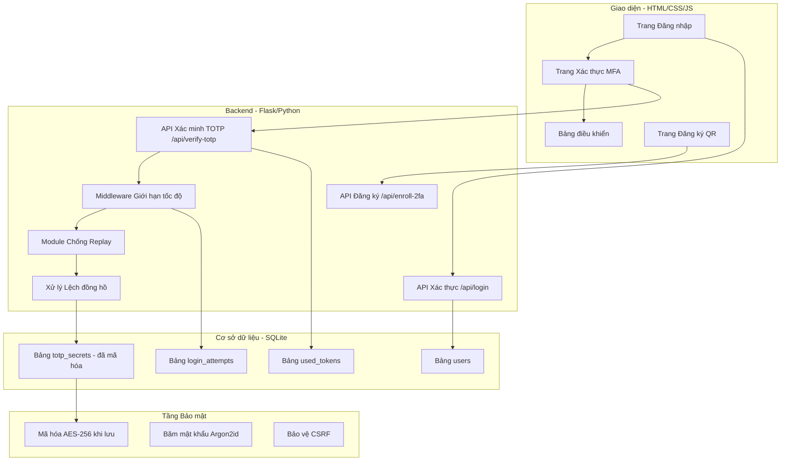
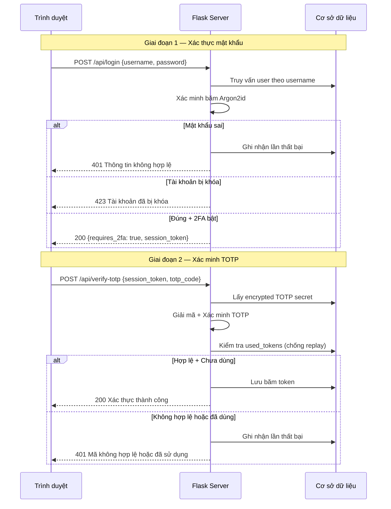

# 🛡️ Kế Hoạch 48 Giờ: Triển Khai TOTP 2FA & Mô Phỏng Tấn Công

> **Môn học:** An toàn Thông tin (BMTT) — Đại học Tôn Đức Thắng (TDTU)  
> **Chủ đề:** Chủ đề 9 – Xác thực Đa yếu tố (Multi-Factor Authentication)  
> **Nhóm:** N01_G01 (52300223, 52300264, 52300266)  
> **Ngày bắt đầu:** 06/04/2026  
> **Phương pháp:** An toàn theo Thiết kế (Security by Design)  

---

## Mục Lục

1. [Tóm tắt tổng quan](#1-tóm-tắt-tổng-quan)  
2. [Tổng quan kiến trúc](#2-tổng-quan-kiến-trúc)  
3. [Công nghệ & Thư viện](#3-công-nghệ--thư-viện)  
4. [Ngày 1: Logic MFA cốt lõi & Bảo mật CSDL](#4-ngày-1-logic-mfa-cốt-lõi--bảo-mật-csdl)  
5. [Ngày 2 Sáng: Giao diện & Đăng ký QR](#5-ngày-2-sáng-giao-diện--đăng-ký-qr)  
6. [Ngày 2 Chiều: Mô phỏng tấn công](#6-ngày-2-chiều-mô-phỏng-tấn-công)  
7. [Cấu trúc thư mục dự án](#7-cấu-trúc-thư-mục-dự-án)  
8. [Câu hỏi mở](#8-câu-hỏi-mở)  
9. [Kế hoạch kiểm thử](#9-kế-hoạch-kiểm-thử)  

---

## 1. Tóm Tắt Tổng Quan

Kế hoạch này mô tả chi tiết quá trình phát triển trong 48 giờ để xây dựng hệ thống Xác thực Hai Yếu tố (2FA) dựa trên TOTP đạt chuẩn production, đồng thời kiểm chứng khả năng chống chịu trước 3 kịch bản tấn công thực tế.

Hệ thống tuân thủ tiêu chuẩn RFC 6238 (TOTP) và RFC 4226 (HOTP), áp dụng nguyên tắc **An toàn theo Thiết kế (Security by Design)**:
- **Phòng thủ chiều sâu** (Defense-in-depth)
- **Đặc quyền tối thiểu** (Least privilege)
- **Mặc định an toàn** (Fail-secure defaults)

Các script prototype hiện có trong `mfa-demo/` (tính HOTP/TOTP thủ công bằng `hmac`, `hashlib`, `struct`, và demo `pyotp`) sẽ được phát triển thành ứng dụng web full-stack với backend được gia cố:

- **Mã hóa secret khi lưu trữ** (AES-256-GCM at rest)
- **Băm mật khẩu Argon2id** (khuyến nghị OWASP)
- **Giới hạn tốc độ & khóa tài khoản lũy tiến**
- **Ngăn chặn tấn công phát lại token**
- **Dung sai lệch đồng hồ có thể cấu hình**

---

## 2. Tổng Quan Kiến Trúc



Kiến trúc phân tách thành 3 tầng:

1. **Tầng Trình bày:** Frontend HTML/CSS/JS tĩnh phục vụ qua Flask.
2. **Tầng Ứng dụng:** Backend API RESTful với chuỗi middleware bảo mật (giới hạn tốc độ → chống replay → dung sai lệch đồng hồ → xác minh TOTP).
3. **Tầng Dữ liệu:** CSDL SQLite được mã hóa. Secret TOTP **không bao giờ** được lưu dưới dạng plaintext — nó được mã hóa bằng AES-256-GCM với khóa server-side sinh từ PBKDF2 với 600.000 vòng lặp.

---

## 3. Công Nghệ & Thư Viện

| Tầng | Công nghệ | Mục đích |
|------|-----------|----------|
| **Backend** | Python 3.11+ / Flask 3.x | Framework web, REST API |
| **TOTP Core** | `pyotp` 2.9+ | Tạo/xác minh TOTP theo RFC 6238 |
| **Mã QR** | `qrcode[pil]` | Tạo mã QR cho ứng dụng xác thực |
| **CSDL** | SQLite3 (tích hợp) | Lưu trữ người dùng, theo dõi token |
| **Mã hóa** | `cryptography` (AES-GCM) | Mã hóa secret TOTP khi lưu |
| **Băm MK** | `argon2-cffi` | Băm mật khẩu Argon2id |
| **Giới hạn** | `flask-limiter` | Giới hạn tốc độ API |
| **CSRF** | `flask-wtf` | Bảo vệ CSRF |
| **Giao diện** | HTML5 / CSS3 / Vanilla JS | Giao diện người dùng |
| **Tấn công** | Python (`requests`) | Mô phỏng tấn công |
| **Kiểm thử** | `pytest` | Kiểm thử đơn vị/tích hợp |

```bash
pip install flask pyotp qrcode[pil] cryptography argon2-cffi flask-limiter flask-wtf requests pytest
```

---

## 4. Ngày 1: Logic MFA Cốt Lõi & Bảo Mật CSDL

### 4.0 Lịch trình

| Khung giờ | Nhiệm vụ | Thời gian |
|-----------|----------|-----------|
| **Giờ 0–2** | Khởi tạo dự án, cài thư viện, thiết kế CSDL | 2 giờ |
| **Giờ 2–5** | TOTP engine: tạo secret, mã hóa, xác minh, chống replay | 3 giờ |
| **Giờ 5–8** | API xác thực: `/api/login`, `/api/verify-totp`, `/api/enroll-2fa` | 3 giờ |
| **Giờ 8–10** | Giới hạn tốc độ, theo dõi đăng nhập, khóa tài khoản | 2 giờ |
| **Giờ 10–12** | Kiểm thử đơn vị cho tất cả module | 2 giờ |

### 4.1 Thiết Kế Lược Đồ CSDL

Cơ sở dữ liệu tuân theo nguyên tắc **tách biệt bí mật** — thông tin xác thực và secret TOTP được lưu trong các bảng riêng biệt. Token đã sử dụng được theo dõi để ngăn chặn tấn công replay.

```sql
-- Bảng người dùng: xác thực cốt lõi
CREATE TABLE IF NOT EXISTS users (
    id INTEGER PRIMARY KEY AUTOINCREMENT,
    username TEXT UNIQUE NOT NULL,
    password_hash TEXT NOT NULL,          -- Băm Argon2id
    is_2fa_enabled BOOLEAN DEFAULT 0,
    created_at TIMESTAMP DEFAULT CURRENT_TIMESTAMP,
    locked_until TIMESTAMP NULL,          -- Thời điểm khóa tài khoản
    failed_attempts INTEGER DEFAULT 0     -- Số lần thất bại liên tiếp
);

-- Bảng secret TOTP: mã hóa khi lưu
CREATE TABLE IF NOT EXISTS totp_secrets (
    id INTEGER PRIMARY KEY AUTOINCREMENT,
    user_id INTEGER UNIQUE NOT NULL,
    encrypted_secret BLOB NOT NULL,       -- Đã mã hóa AES-256-GCM
    encryption_iv BLOB NOT NULL,          -- Vector khởi tạo
    created_at TIMESTAMP DEFAULT CURRENT_TIMESTAMP,
    FOREIGN KEY (user_id) REFERENCES users(id) ON DELETE CASCADE
);

-- Bảng token đã sử dụng: ngăn replay
CREATE TABLE IF NOT EXISTS used_tokens (
    id INTEGER PRIMARY KEY AUTOINCREMENT,
    user_id INTEGER NOT NULL,
    token_hash TEXT NOT NULL,             -- Băm SHA-256 của OTP đã dùng
    time_step INTEGER NOT NULL,           -- Bước thời gian TOTP khi sử dụng
    used_at TIMESTAMP DEFAULT CURRENT_TIMESTAMP,
    FOREIGN KEY (user_id) REFERENCES users(id) ON DELETE CASCADE
);
CREATE UNIQUE INDEX idx_used_tokens ON used_tokens(user_id, token_hash, time_step);

-- Bảng lượt đăng nhập: nhật ký kiểm toán
CREATE TABLE IF NOT EXISTS login_attempts (
    id INTEGER PRIMARY KEY AUTOINCREMENT,
    user_id INTEGER,
    ip_address TEXT NOT NULL,
    attempt_type TEXT NOT NULL,           -- 'password' hoặc 'totp'
    success BOOLEAN NOT NULL,
    attempted_at TIMESTAMP DEFAULT CURRENT_TIMESTAMP,
    FOREIGN KEY (user_id) REFERENCES users(id) ON DELETE SET NULL
);
```

### 4.2 Module TOTP Engine

> **Quyết định thiết kế bảo mật:**  
> Secret TOTP được mã hóa khi lưu trữ bằng AES-256-GCM. Khóa mã hóa được sinh từ biến môi trường `TOTP_MASTER_KEY` qua PBKDF2 với 600.000 vòng lặp. Điều này đảm bảo rằng ngay cả khi database bị lộ, các secret vẫn được bảo vệ.

```python
class TOTPEngine:
    """Engine TOTP tuân thủ RFC 6238 với gia cố bảo mật."""
    
    def __init__(self, master_key: str):
        # Sinh khóa mã hóa từ master_key qua PBKDF2 (600K vòng lặp)
        self._cipher_key = self._derive_key(master_key)
    
    def generate_secret(self) -> str:
        """Tạo secret Base32 an toàn bằng mật mã (160 bit)."""
        return pyotp.random_base32(length=32)
    
    def encrypt_secret(self, secret: str) -> tuple[bytes, bytes]:
        """Mã hóa bằng AES-256-GCM. Trả về (bản mã, iv)."""
        pass
    
    def decrypt_secret(self, ciphertext: bytes, iv: bytes) -> str:
        """Giải mã secret từ CSDL."""
        pass
    
    def verify_totp(self, secret, token, valid_window=1, user_id=None) -> dict:
        """Xác minh TOTP với: kiểm tra định dạng, so sánh an toàn thời gian,
        ngăn replay, và dung sai lệch đồng hồ.
        Trả về: {valid: bool, reason: str, time_step: int}"""
        pass
    
    def generate_qr_uri(self, secret, email, issuer="TDTU-InfoSec-MFA") -> str:
        """Tạo URI otpauth:// cho ứng dụng xác thực."""
        return pyotp.TOTP(secret).provisioning_uri(name=email, issuer_name=issuer)
```

| Tính năng | Lý do |
|-----------|-------|
| `valid_window=1` | Dung sai lệch ±30 giây. RFC 6238 §5.2 khuyến nghị. |
| Chống replay | Lưu băm SHA-256 của token đã dùng theo bước thời gian. |
| AES-256-GCM | Mã hóa có xác thực — tính bảo mật VÀ toàn vẹn. |
| So sánh an toàn | `hmac.compare_digest()` ngăn tấn công kênh phụ thời gian. |

### 4.3 API Xác Thực

| Endpoint | Phương thức | Mục đích | Giới hạn |
|----------|------------|----------|----------|
| `/api/register` | POST | Tạo tài khoản | 5/phút |
| `/api/login` | POST | Xác thực mật khẩu | 10/phút |
| `/api/verify-totp` | POST | Xác minh mã TOTP | 5/phút/user |
| `/api/enroll-2fa` | POST | Tạo secret + QR | 3/phút |
| `/api/confirm-2fa` | POST | Xác nhận đăng ký | 5/phút |
| `/api/status` | GET | Kiểm tra trạng thái | 30/phút |



### 4.4 Giới Hạn Tốc Độ & Khóa Tài Khoản

> **Quan trọng:** Nếu không có giới hạn tốc độ, kẻ tấn công có thể thử tất cả 1.000.000 mã OTP 6 chữ số. Với 1000 request/giây, chỉ mất ~17 phút.

| Tầng | Giới hạn | Phạm vi |
|------|----------|---------|
| Xác minh TOTP | 5 lần/30 giây | Theo user |
| Xác minh TOTP | 10 lần/5 phút | Theo user |
| Khóa bậc 1 | Sau 5 lần thất bại | Khóa 15 phút |
| Khóa bậc 2 | Sau 10 lần thất bại | Khóa 1 giờ |
| Khóa bậc 3 | Sau 20 lần thất bại | Khóa 24 giờ |
| Theo IP | 20 request TOTP/phút | Theo địa chỉ IP |

---

## 5. Ngày 2 Sáng: Giao Diện & Đăng Ký QR

### 5.0 Lịch trình

| Khung giờ | Nhiệm vụ | Thời gian |
|-----------|----------|-----------|
| **Giờ 12–14** | Trang đăng nhập với thiết kế glassmorphism tối | 2 giờ |
| **Giờ 14–16** | Form xác thực MFA (6 ô nhập tự động chuyển) | 2 giờ |
| **Giờ 16–18** | Trình hướng dẫn đăng ký QR | 2 giờ |
| **Giờ 18–20** | Bảng điều khiển, xử lý lỗi, hoàn thiện UX | 2 giờ |

### 5.1 Các Trang Giao Diện

- **Đăng nhập:** Giao diện tối, thẻ glassmorphism, gradient động, nhãn nổi
- **Xác minh MFA:** 6 ô số riêng biệt, đếm ngược 30 giây, phản hồi trực quan
- **Đăng ký 2FA:** Trình tự từng bước (tải app → quét QR → nhập thủ công → xác minh)
- **Bảng điều khiển:** Trạng thái bảo mật, lịch sử đăng nhập, quản lý 2FA

### 5.2 Hệ Thống Thiết Kế CSS

| Biến | Giá trị | Mục đích |
|------|---------|----------|
| `--bg-primary` | `#0a0e27` | Nền xanh navy đậm |
| `--accent-1` | `#667eea` | Xanh điện |
| `--accent-2` | `#764ba2` | Tím |
| `--gradient-main` | `linear-gradient(135deg, #667eea, #764ba2)` | Gradient chính |
| `--text-primary` | `#e2e8f0` | Chữ sáng |

Tính năng: glassmorphism (`backdrop-filter: blur(20px)`), font Inter, micro-animation, responsive

---

## 6. Ngày 2 Chiều: Mô Phỏng Tấn Công

### 6.0 Lịch trình

| Khung giờ | Nhiệm vụ | Thời gian |
|-----------|----------|-----------|
| **Giờ 20–22** | Kịch bản 1: Vét cạn + phân tích toán học | 2 giờ |
| **Giờ 22–23** | Kịch bản 2: Phát lại token | 1 giờ |
| **Giờ 23–24** | Kịch bản 3: Lệch đồng hồ | 1 giờ |
| **Còn lại** | Tài liệu, sửa lỗi, chuẩn bị demo | — |

> ⚠️ **Chỉ dành cho mục đích giáo dục.** Các script này chỉ để kiểm thử trên hệ thống CỦA BẠN. Việc kiểm thử trái phép là vi phạm pháp luật.

### 6.1 Kịch Bản 1: Tấn Công Vét Cạn (Brute-Force)

| Tham số | Giá trị |
|---------|---------|
| **Vectơ tấn công** | Liệt kê tất cả mã OTP từ 000000–999999 |
| **Không gian khóa** | 1.000.000 tổ hợp |
| **Cửa sổ** | 30 giây (chu kỳ TOTP) |
| **Tốc độ cần thiết** | ~33.333 lần thử/giây để vét cạn |

```python
def bruteforce_sequential(session_token, max_attempts=1000):
    """Thử tuần tự 000000, 000001, ... cho đến khi bị giới hạn hoặc khóa."""
    results = {"total_attempts": 0, "rate_limited_at": None, "locked_at": None}
    for code in range(max_attempts):
        otp = f"{code:06d}"
        r = requests.post(TARGET, json={"session_token": session_token, "totp_code": otp})
        results["total_attempts"] += 1
        if r.status_code == 429:
            results["rate_limited_at"] = results["total_attempts"]; break
        elif r.status_code == 423:
            results["locked_at"] = results["total_attempts"]; break
        elif r.status_code == 200:
            results["cracked"] = True; break
    return results
```

**Kết quả mong đợi:**

| Chỉ số | Không bảo vệ | Có giới hạn | Giới hạn + Khóa TK |
|--------|-------------|-------------|---------------------|
| Lần thử trước khi chặn | ∞ | 5/30 giây | 5 rồi khóa |
| P(bẻ trong 30s) | ~3,3% ở 1K/s | 0,0005% | 0,0005% |
| Thời gian vét cạn | ~17 phút | ~69 ngày | ~5,76 năm |
| Đánh giá | ❌ Nghiêm trọng | ⚠️ Tốt | ✅ Xuất sắc |

**Phân tích toán học:**
```
Không bảo vệ:  P = R × 30 / 1.000.000  (R=1000 → 3%)
Có giới hạn:   5/1M = 5×10⁻⁶ mỗi cửa sổ → 200K cửa sổ → 69 ngày
Có khóa TK:    5 mỗi 930 giây → 500K lần thử trung bình → 2,95 năm
Khóa lũy tiến: Sau 20 lần → khóa 24h → KHÔNG KHẢ THI
```

### 6.2 Kịch Bản 2: Tấn Công Phát Lại Token (Replay Attack)

| Tham số | Giá trị |
|---------|---------|
| **Vectơ tấn công** | Chặn OTP hợp lệ (MITM/nhìn trộm), phát lại trong cùng cửa sổ 30 giây |
| **Điều kiện tiên quyết** | Kẻ tấn công sở hữu mã OTP hợp lệ đã được sử dụng |

```python
def replay_attack(session_token, secret):
    """Kiểm tra: dùng OTP hợp lệ, sau đó dùng lại ngay lập tức."""
    totp = pyotp.TOTP(secret)
    valid_code = totp.now()
    # Lần 1 — người dùng hợp pháp
    r1 = requests.post(TARGET, json={"session_token": session_token, "totp_code": valid_code})
    # Phát lại ngay — kẻ tấn công dùng mã đánh cắp
    r2 = requests.post(TARGET, json={"session_token": session_token, "totp_code": valid_code})
    # Phát lại sau 5 giây
    time.sleep(5)
    r3 = requests.post(TARGET, json={"session_token": session_token, "totp_code": valid_code})
    return {"lan_1": r1.status_code, "phat_lai_ngay": r2.status_code, "phat_lai_5s": r3.status_code}
```

| Lần thử | Không có chống replay | Có chống replay |
|---------|----------------------|-----------------|
| Lần 1 (mã hợp lệ) | ✅ 200 OK | ✅ 200 OK |
| Lần 2 (phát lại ngay) | ✅ 200 ❌ LỖ HỔNG | ❌ 401 "Mã đã sử dụng" |
| Lần 3 (sau 5 giây) | ✅ 200 ❌ LỖ HỔNG | ❌ 401 "Mã đã sử dụng" |

**Cơ chế phòng thủ:** Lưu SHA-256(token) theo (user_id, time_step) trong bảng `used_tokens`. Chỉ mục UNIQUE đảm bảo ở cấp CSDL.

### 6.3 Kịch Bản 3: Phân Tích Lệch Đồng Hồ (Clock Skew)

| Tham số | Giá trị |
|---------|---------|
| **Vectơ tấn công** | Mất đồng bộ đồng hồ giữa điện thoại và server |
| **Nguyên nhân** | Lỗi NTP, sai múi giờ, thiết bị trôi đồng hồ |
| **Phạm vi kiểm tra** | -180 giây đến +180 giây, bước 15 giây |

```python
def generate_totp_at_offset(secret, offset_seconds):
    """Tạo mã TOTP như thể đồng hồ client lệch N giây."""
    client_time = int(time.time()) + offset_seconds
    client_step = client_time // 30
    counter_bytes = struct.pack(">Q", client_step)
    key = base64.b32decode(secret)
    h = hmac.new(key, counter_bytes, hashlib.sha1).digest()
    o = h[-1] & 0x0F
    code = struct.unpack(">I", h[o:o+4])[0] & 0x7FFFFFFF
    return f"{code % 1000000:06d}"
```

**Kết quả mong đợi (`valid_window=1`):**

| Độ lệch | Số bước lệch | Kết quả |
|---------|-------------|---------|
| 0 giây | 0 | ✅ Chấp nhận |
| ±15 giây | 0 | ✅ Chấp nhận |
| ±30 giây | ±1 | ✅ Chấp nhận |
| ±45 giây | ±1 | ✅/❌ Biên |
| ±60 giây | ±2 | ❌ Từ chối |
| ±90 giây | ±3 | ❌ Từ chối |

**Bảng đánh đổi bảo mật:**
```
valid_window=0 → 1 mã hoạt động  → P = 0,0001%
valid_window=1 → 3 mã hoạt động  → P = 0,0003% ← KHUYẾN NGHỊ
valid_window=2 → 5 mã hoạt động  → P = 0,0005%
valid_window=3 → 7 mã hoạt động  → P = 0,0007%
```

**Khuyến nghị:** `valid_window=1` cung cấp sự cân bằng tối ưu:
- **Khả dụng:** Xử lý drift NTP bình thường (hầu hết điện thoại đồng bộ trong ±5 giây)
- **Bảo mật:** Chỉ có 3 mã hợp lệ cùng lúc (mở rộng 3x là không đáng kể)
- **Tuân thủ RFC:** RFC 6238 §5.2 khuyến nghị window = 1 làm mặc định

---

## 7. Cấu Trúc Thư Mục Dự Án

```
mfa-demo/
├── app/
│   ├── __init__.py, config.py
│   ├── core/      (totp_engine.py, crypto.py, auth.py)
│   ├── models/    (database.py)
│   ├── middleware/ (rate_limiter.py)
│   ├── routes/    (auth_routes.py, page_routes.py)
│   ├── templates/ (base, login, register, verify_totp, enroll_2fa, dashboard .html)
│   └── static/    (css/styles.css, js/login.js, verify.js, enroll.js)
├── database/      (schema.sql)
├── attacks/       (attack_bruteforce.py, attack_replay.py, attack_clock_skew.py)
├── tests/         (test_totp_engine.py, test_auth_routes.py, test_rate_limiter.py)
├── docs/          (IMPLEMENTATION_PLAN_EN.md, IMPLEMENTATION_PLAN_VI.md)
├── run.py, requirements.txt, .env.example, README.md
```

---

## 8. Câu Hỏi Mở

1. **Cơ sở dữ liệu:** SQLite (đơn giản) hay PostgreSQL/MySQL (giống production hơn)?
2. **Mã dự phòng:** Triển khai mã khôi phục một lần? (+2 giờ)
3. **Phiên làm việc:** JWT token hay Flask session phía server?
4. **Môi trường tấn công:** Localhost hay ngữ cảnh mạng riêng biệt?
5. **Định dạng demo:** Terminal hay Jupyter notebook tương tác?

---

## 9. Kế Hoạch Kiểm Thử

### Kiểm thử tự động
```bash
pytest tests/ -v --tb=short
pytest tests/ --cov=app --cov-report=html
python attacks/attack_bruteforce.py --target http://localhost:5000
python attacks/attack_replay.py --target http://localhost:5000
python attacks/attack_clock_skew.py --target http://localhost:5000
```

### Danh sách kiểm tra thủ công

| # | Hành động | Kết quả mong đợi |
|---|----------|------------------|
| 1 | Đăng ký người dùng mới | Tài khoản tạo → chuyển đến đăng ký 2FA |
| 2 | Quét QR bằng Google Authenticator | App hiển thị mã 6 số cuộn |
| 3 | Nhập mã hợp lệ khi đăng ký | 2FA được xác nhận |
| 4 | Đăng nhập đúng mật khẩu | Yêu cầu nhập mã TOTP |
| 5 | Nhập mã TOTP đúng | Truy cập bảng điều khiển |
| 6 | Nhập sai TOTP 5 lần | Tài khoản khóa 15 phút |
| 7 | Dùng lại mã đã sử dụng | Bị từ chối |
| 8 | Đồng hồ hệ thống lệch ±2 phút | Mã bị từ chối |
